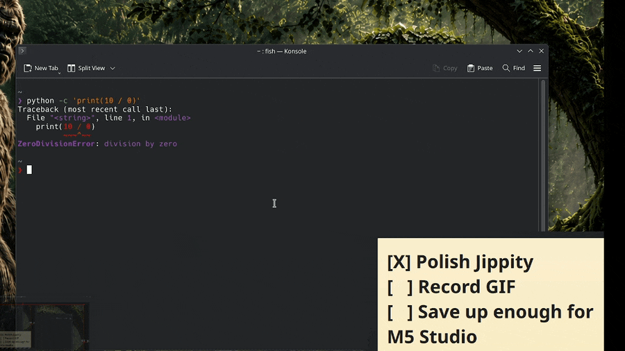
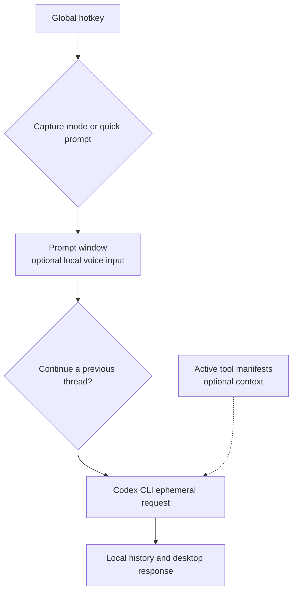

<div align="center">

# Jippity

**Point at something on your desktop. Ask Codex about it. Keep moving.**

A lightweight KDE Plasma and Wayland frontend for the [Codex CLI](https://github.com/openai/codex): capture what you see, ask a question, and get the response in a desktop popup.


</div>

<!--
<p align="center">
  
</p>
-->

Jippity is a thin desktop UX layer, not a new model or agent framework. The Codex CLI still owns authentication, model access, and model execution. Jippity handles the hotkeys, screenshots, prompt window, local thread history, and desktop response.

## Why Jippity?

It started with a small friction point: asking Codex about something already visible on the desktop meant opening a terminal, making or finding a screenshot, attaching it, and breaking the flow. Jippity reduces that to a hotkey, an optional capture, and a question.

## What Jippity Can Do

| Area | What ships today |
|---|---|
| **Capture and ask** | Select a region, capture the active window or full screen, or send a text-only quick prompt. Screenshot cancellation and capture errors are handled before a request is sent. |
| **Desktop flow** | Bind suggested KDE global shortcuts, get a response-ready notification, then read the answer in a dynamically sized desktop popup. |
| **Prompt experience** | Use an always-on-top native PyQt6 prompt when available, press Enter to send, continue a prior thread, or opt into live web search for one prompt. Ordinary prompts fall back to a KDialog flow without PyQt6. |
| **Local threads** | Start fresh threads, reconstruct earlier context locally, search prompts and responses, read transcripts, see timestamps/exchange counts/modes, set an older thread active, and delete threads with their stored screenshots. |
| **Optional voice** | Hold Alt or the on-screen button to record with `parecord`; whisper.cpp inserts a local transcription at the cursor for editing before you send it. |
| **Custom tools** | Opt in to tool manifests that teach Codex about commands you already have. Their separate full-system-access option stays off by default and requires approval for each prompt. |
| **Jippity Doctor** | Run local, read-only diagnostics for the platform, dependencies, Codex authentication, voice support, files, state locations, history access, and active manifests. |

## The Flow



## Quick Start

```bash
git clone https://github.com/BDubDesigns/codex-jippity.git
cd codex-jippity
./jippity-setup
./jippity-doctor
```

`jippity-setup` creates Jippity's local directories and prints KDE shortcut instructions. It does **not** install packages. Install any missing dependencies yourself, then point KDE shortcuts at the absolute path of the relevant command. Run Jippity Doctor to see what is missing before troubleshooting by hand.

## Suggested Hotkeys

These bindings are suggestions, not automatic installs. Add them in **KDE System Settings > Shortcuts > Custom Shortcuts**.

| Shortcut | Command | Use it for |
|---|---|---|
| Super+S | `/path/to/codex-jippity/jippity --mode region` | Select part of the screen, then ask |
| Super+W | `/path/to/codex-jippity/jippity --mode screen` | Ask about the full screen |
| Super+A | `/path/to/codex-jippity/jippity --mode window` | Ask about the active window |
| Super+Q | `/path/to/codex-jippity/jippity --mode quick` | Ask a text-only question |
| Super+H | `/path/to/codex-jippity/jippity --history` | Browse, search, manage, or continue threads |
| Super+V | `/path/to/codex-jippity/jippity --voice` | Toggle optional voice input |

### Direct Commands

```bash
./jippity --mode region
./jippity --mode window
./jippity --mode screen
./jippity --mode quick
./jippity --history
./jippity --voice
./jippity-doctor
./jippity-doctor --json
./jippity-tools --list
./jippity-tools --json
```

## Good Fits for Jippity

- Capture an error dialog and ask what it means.
- Select part of an application and ask how to use it.
- Capture a terminal failure and ask for the next debugging step.
- Ask a quick text-only question without opening a terminal first.
- Continue a troubleshooting thread from earlier in the day.
- Dictate a prompt while staying in the current desktop workflow.
- Run Jippity Doctor, then let Codex summarize its findings through the opt-in doctor manifest.

These are workflow examples, not a guarantee that any model answer is correct. Review advice before applying it.

## Threads and History

Every fresh conversation gets a local thread ID. When you choose **Continue previous thread**, Jippity reconstructs prior prompts and responses from local JSONL history and prepends that context to the next request. It does not depend on Codex's saved session store.

The graphical history viewer lets you search prompts and responses, read complete transcripts, inspect modes/timestamps/exchange counts, identify the active thread, set an older thread active, and multi-select threads for deletion. Deleting a thread also removes its associated stored screenshots. The graphical history viewer requires PyQt6; there is no KDialog history fallback.

## Voice Input, Locally

Voice is optional and disabled by default. With `parecord`, whisper.cpp, and a compatible model available:

1. Turn it on with `./jippity --voice`.
2. Hold Alt or the on-screen **Hold to Talk** button while the prompt is open.
3. Release to transcribe locally.
4. Edit the inserted text, then send it when you are ready.

Nothing auto-submits. Missing voice dependencies do not block normal text prompting.

## Custom Codex Tools

Custom tools are optional. They are a way to give Codex instructions for using commands on your machine, not a requirement for ordinary Jippity use.

- Active tool manifests live in `tools/`; examples live outside active discovery in `examples/tools/`.
- A tool manifest teaches Codex about a command. It does not install or implement that command.
- External commands must already be installed and available in `$PATH`.
- Bundled commands can be resolved independently of the current working directory.
- `@command` defines the invocation; repeatable `@instruction` entries give Codex behavioral guidance.
- `./jippity-tools`, `--list`, and `--json` expose active manifests. The graphical history viewer can show them too.
- **Use live web search** is always available for any prompt. It adds Codex live-web search only; it is off by default and never remembered.
- **Allow trusted tools full system access** appears only when active tools exist. It controls the explicit `danger-full-access` sandbox bypass; it is also off by default and never remembered.
- Live web search and full system access are independent. Internet questions do not require full system access.

The bundled Doctor executable ships with Jippity, but its teaching manifest remains inactive until you choose to enable it:

```bash
cp examples/tools/jippity-doctor tools/jippity-doctor
```

This copies metadata only. It does not install a command. The Doctor manifest does not need networking or unsandboxed execution.

## Jippity Doctor

Run `./jippity-doctor` for a concise human report, or `./jippity-doctor --json` for the `jippity-doctor/v1` structured report with stable check IDs.

| Exit code | Meaning |
|---|---|
| `0` | Required runtime checks pass; recommended or optional checks may still warn. |
| `1` | At least one required runtime check failed. |
| `2` | Invalid command-line usage. |

Doctor checks Linux/platform signals, required dependencies, Codex CLI authentication, PyQt6, optional voice components, bundled script permissions, state and history locations, and active tool manifests. It is local and read-only: no support bundle upload, no automatic repair, no model/API request, and no `danger-full-access`. It may run `codex --version` and `codex login status` locally; authentication details and command output are never reported. Home-directory paths are sanitized in its output.

## Dependencies

Some dependencies may already be present depending on your distribution and KDE setup.

<details>
<summary><strong>Required</strong></summary>

- Codex CLI (`codex`)
- Spectacle (`spectacle`)
- KDialog (`kdialog`)
- `jq`
- Python 3
- Standard Unix commands used by the scripts, including `bash`, `cat`, `date`, `dirname`, `fold`, `grep`, `mkdir`, `mktemp`, `pwd`, `rm`, `tr`, and `wc`

</details>

<details>
<summary><strong>Recommended: PyQt6</strong></summary>

PyQt6 provides the combined prompt dialog and is required for the graphical history viewer. Without it, ordinary prompts use the two-step KDialog fallback and `jippity --history` is unavailable.

</details>

<details>
<summary><strong>Optional voice input</strong></summary>

- `parecord`, or the appropriate PipeWire/PulseAudio compatibility package
- whisper.cpp
- A compatible Whisper model

CachyOS/Arch example:

```bash
paru -S whisper.cpp whisper.cpp-model-small.en
```

</details>

## Privacy and Local Data

- Configuration and state live under `~/.config/jippity/`.
- History, screenshots, responses, and logs live under `~/.local/share/jippity/`.
- Prompts and selected screenshots are passed to the Codex CLI, subject to your Codex/OpenAI configuration and applicable policies.
- Saved local history can itself contain sensitive prompts, answers, and screenshots.
- whisper.cpp transcription runs locally when used.
- Jippity Doctor is local and read-only.
- Tool manifests may teach Codex to run local commands. Review them before activation.
- Unsandboxed execution gives Codex-invoked commands broad local-file and network access as your user. Leave it off unless a trusted tool truly requires it.

## Under the Hood

<details>
<summary>Small pieces, deliberately</summary>

- Shell scripts orchestrate capture, prompt flow, persistence, and display.
- Small PyQt6 helpers provide the combined prompt dialog and graphical history viewer.
- Spectacle captures images; KDialog handles fallback prompts, notifications, and response display.
- Requests use `codex exec --ephemeral`.
- Local JSONL history reconstructs conversation context instead of relying on Codex session storage.
- whisper.cpp is an optional local transcription path.
- Jippity Doctor uses only the Python standard library for diagnostics.
- There is no daemon and no build system.

</details>

## Platform Status and Roadmap

Jippity is Linux-only, designed for KDE Plasma on Wayland, and tested on CachyOS/Arch Linux. Other distributions and desktop environments are not broadly tested.

Core capture, prompt, local history, voice, tools, and diagnostics flows are implemented. A richer GUI or tray remains future work. Jippity is a personal open-source project, not an official OpenAI product.

## License

[MIT License](LICENSE)
